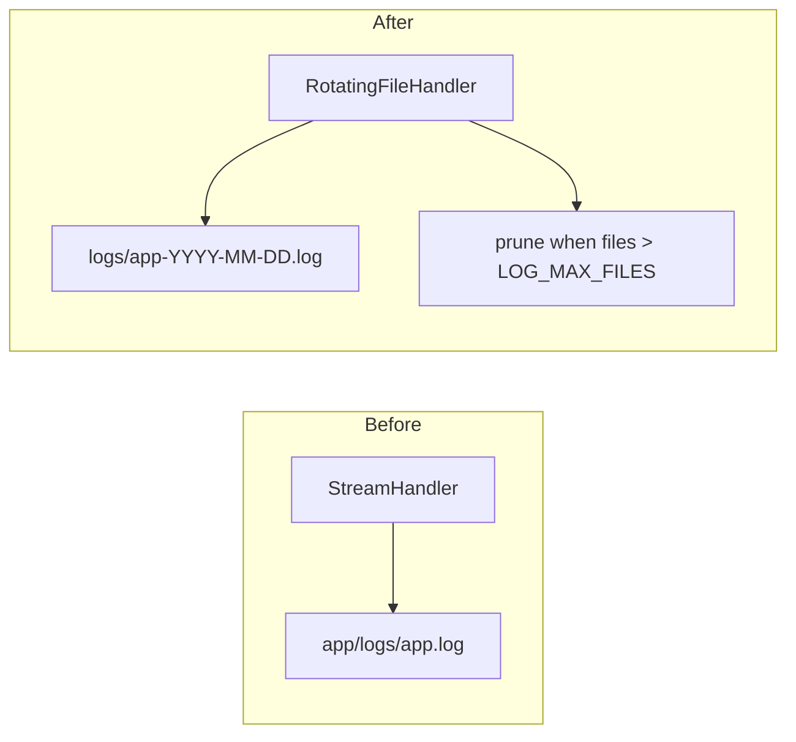
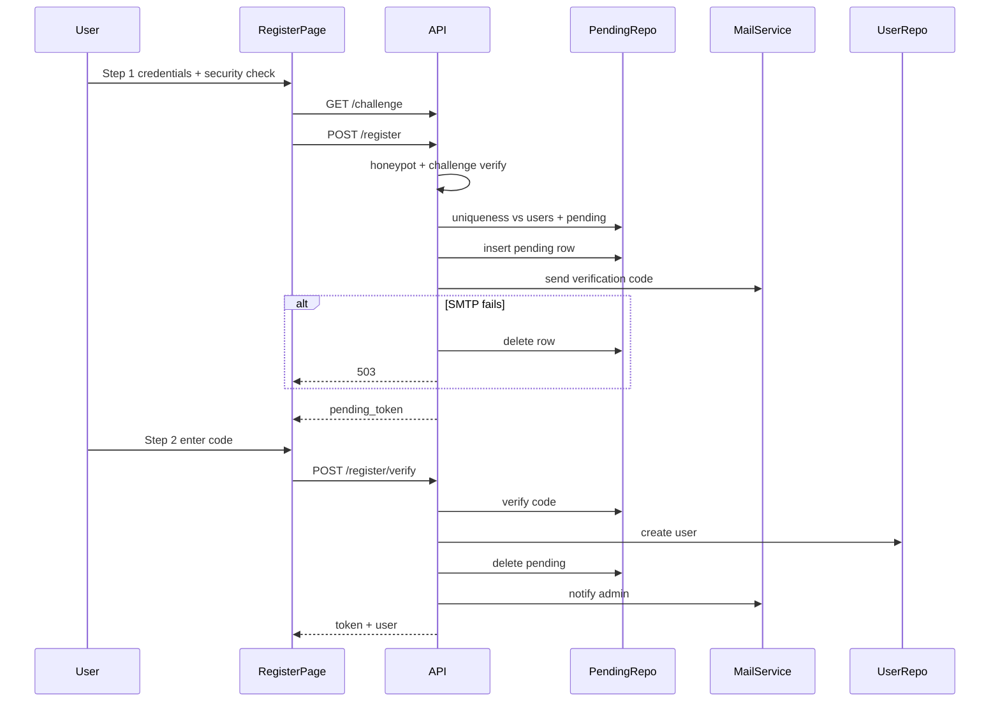

# Migration guides for forked apps

Use this file (and linked guides) to bring an **existing fork** of `vibe-flight-react-template` up to date without re-scaffolding.

## Which guide do I need?

| Guide | Scope | Apply when |
|-------|-------|------------|
| [update.md](update.md) | Frontend only | `/` is still the signed-in dashboard; guests go to `/login` |
| **Rolling log files** ([below](#rolling-log-files-backend-only)) | Backend only (~10 min) | Single growing `app.log`, or logs under `app/logs/` instead of deploy-root `logs/` |
| **Contact Us + legal + GA4** ([below](#contact-us-legal-pages-cookie-consent-and-ga4)) | Full-stack | Missing contact form, SMTP, rate limits, `/terms`, cookie banner, admin submissions |
| **Email-verified registration** ([below](#email-verified-registration)) | Full-stack | Registration is single-step (`POST /register` creates user immediately); no email verification, human check, or admin notify on sign-up |

Apply guides **independently** — you do not need the contact update to apply rolling logs, and vice versa.

For feature rationale, see [guideline.md](guideline.md). For production deploy details, see [DEPLOY.md](DEPLOY.md).

---

## Rolling log files (backend-only)

**Scope:** `AppConfig.php`, `services.php`, repo-root `.env` / `.env.example`. No database, frontend, or `build.sh` changes.

### What changes

| Before | After |
|--------|--------|
| Monolog `StreamHandler` → one `app.log` that grows forever | `RotatingFileHandler` → daily `app-YYYY-MM-DD.log` files |
| `LOG_DIR` resolved under `app/` (e.g. `backend/app/logs/`) | `LOG_DIR` resolved from **backend / deploy root** (e.g. `backend/logs/`, `dist/logs/`) |
| No retention | Oldest files deleted when count exceeds `LOG_MAX_FILES` (default `14`) |



### Step 1 — Environment

Add to repo-root `.env` (and merge into `.env.example`):

```
LOG_DIR=logs
LOG_MAX_FILES=14
```

- `LOG_DIR` is relative to the **backend root** locally (`backend/logs/`) and **deploy root** in production (`dist/logs/`).
- If you previously used `LOG_DIR=../../logs` or `LOG_DIR=../logs` to work around the old path bug, switch to `LOG_DIR=logs` after patching `services.php` below.

### Step 2 — `app/Config/AppConfig.php`

1. Add property: `private static int $logMaxFiles;`
2. In `load()`, after `LOG_DIR`:

   ```php
   self::$logMaxFiles = max(1, (int) ($_ENV['LOG_MAX_FILES'] ?? '14'));
   ```

3. Add getter:

   ```php
   public static function getLogMaxFiles(): int
   {
       return self::$logMaxFiles;
   }
   ```

### Step 3 — `app/Config/services.php`

1. Replace the import:

   ```php
   use Monolog\Handler\RotatingFileHandler;
   ```

   (remove `StreamHandler` if present)

2. Fix log directory resolution — **two** levels up from `app/Config`, not one:

   ```php
   $logDir = dirname(__DIR__, 2) . $ds . AppConfig::getLogDir();
   ```

3. Replace the handler:

   ```php
   $logger->pushHandler(new RotatingFileHandler(
       "$logDir/app.log",
       AppConfig::getLogMaxFiles(),
       AppConfig::resolveLogLevel()
   ));
   ```

Tracy (dev exception dumps) uses the same `$logDir`; only Monolog application logs rotate.

### Step 4 — Deploy and cleanup (optional)

- Rebuild and redeploy as usual; `build.sh` already creates `dist/logs/`.
- **Path change:** new logs appear under backend/deploy root `{LOG_DIR}/` (e.g. `backend/logs/`, `dist/logs/`), not `app/{LOG_DIR}/`. Old files in `app/log/` or `app/logs/` are **not** migrated automatically — archive or delete when convenient.
- A legacy undated `app.log` may remain from before this update; new entries go to dated files only.

### Verification

- [ ] `composer test` passes in `backend/`
- [ ] After one API request, today's file exists: `logs/app-$(date +%F).log` (under backend root locally, deploy root in production)
- [ ] `tail -f logs/app-$(date +%F).log` shows migration / runtime entries
- [ ] Production: `dist/logs/app-*.log` exists — **not** `dist/app/logs/`

### Troubleshooting

| Symptom | Likely cause | Fix |
|---------|--------------|-----|
| Logs still under `app/logs/` | `services.php` not patched | Use `dirname(__DIR__, 2)` for `$logDir` |
| `Cannot create log directory` | Permissions on deploy host | `chmod 755 logs` (or `775`) — see [DEPLOY.md](DEPLOY.md) |
| Runbook tails wrong file | Dated filenames | Use `logs/app-$(date +%F).log` or `tail -f logs/app-*.log` |
| SMTP errors invisible | Wrong log path in ops docs | Search `logs/app-*.log` for `smtp.send_failed` |

---

## Contact Us, legal pages, cookie consent, and GA4

Apply this section to forks that predate the public-site feature set (Contact Us form, SMTP, rate limiting, human check, Terms/Privacy, cookie consent, GA4, submission admin).

**Scope:** full-stack — backend API, database migrations, frontend UI, repo-root `.env`, and `build.sh`.

If your fork still uses `/` as the signed-in dashboard, apply [update.md](update.md) first.

---

## What this update adds

| Area | Capability |
|------|------------|
| Contact form | Public **Contact Us** on landing — firstname, surname, email, known as, category, message (250 chars) |
| Human check | Honeypot + math challenge + 3-second minimum submit time |
| Rate limiting | 1/min, 3/hr, 10/lifetime per email; 5/hr per IP |
| Email | PHPMailer SMTP auto-ack on submit; admin follow-up reply |
| Legal | Public `/terms` and `/privacy` with shared layout and footer links |
| Cookie consent | Opt-in banner (`app_consent` cookie); analytics category |
| GA4 | Consent-gated Google Analytics; manual SPA pageviews |
| Admin | `/admin/submissions` — list, ignore, send follow-up; status chips **New** / **Replied** (green) / **Ignored** |

```mermaid
flowchart LR
  guest[Landing page] --> challenge[GET /api/v1/challenge]
  guest --> contact[POST /api/v1/contact]
  contact --> db[(submissions + rate_limits)]
  contact --> smtp[SMTP auto-ack]
  admin[Admin JWT] --> subApi[/api/v1/admin/submissions]
  subApi --> db
  subApi --> smtp
```

---

## Prerequisites

- Fork based on `vibe-flight-react-template` with JWT auth and `/api/v1` routes already in place.
- PHP 8.3+ with `pdo_mysql`, MySQL/MariaDB.
- If the fork lacks the public landing page (`/` = marketing, `/dashboard` = home), apply [update.md](update.md) first.
- Node.js and npm for frontend dependency and build updates.

---

## Breaking / behavioural changes

| Before | After |
|--------|--------|
| `backend/.env` only | **Repo-root** `.env` (single source for PHP + Vite); `backend/.env.example` is a pointer |
| No contact tables | `submissions` and `rate_limits` created on API boot via SQL migrations |
| `LOG_DIR=../../logs` or logs under `app/logs/` | `LOG_DIR=logs` at backend/deploy root + daily rotation — see [Rolling log files](#rolling-log-files-backend-only) |
| No public legal routes | `/terms`, `/privacy` under `PublicLayout` |
| Admin nav: Users only | **Submissions** + Users for `ADMIN_USERNAMES` |
| Submission status always “New” | **Replied** (theme `success` / green) when `follow_up_sent_at` is set |

---

## Step 1 — Environment migration

1. If you have `backend/.env`, **merge** it into a new repo-root `.env`:

   ```bash
   cp backend/.env .env
   ```

2. Copy the full template from upstream [`.env.example`](.env.example) and merge any missing keys into your `.env`.

3. Generate new secrets:

   ```bash
   openssl rand -hex 32   # CHALLENGE_SECRET
   ```

4. Add SMTP settings. Local development with [Mailpit](https://github.com/axllent/mailpit):

   ```
   SMTP_HOST=127.0.0.1
   SMTP_PORT=1025
   SMTP_SECURE=none
   SMTP_FROM_EMAIL=noreply@example.com
   SMTP_FROM_NAME=Your App Name
   ```

5. Add frontend build vars (used by Vite at `npm run build`):

   ```
   VITE_SITE_URL=https://your-domain.example/app/
   VITE_GA_MEASUREMENT_ID=G-XXXXXXXXXX
   ```

6. Set CORS for dev:

   ```
   CORS_ORIGINS=http://localhost:5173,https://your-domain.example
   ```

7. Remove or stop using `backend/.env` to avoid two sources of truth.

### Environment variable reference

| Variable | Purpose |
|----------|---------|
| `CHALLENGE_SECRET` | HMAC secret for signed math-challenge tokens |
| `SMTP_*` | PHPMailer outbound mail |
| `CORS_ORIGINS` | Allowed CORS origins (comma-separated) |
| `LOG_MAX_FILES` | Daily log retention count (default `14`) — see [Rolling log files](#rolling-log-files-backend-only) |
| `VITE_GA_MEASUREMENT_ID` | GA4 Measurement ID (production builds only) |
| `VITE_SITE_URL` | Canonical URL for SEO/legal canonical links |

**WSL/Linux:** use `DB_HOST=127.0.0.1`, not `localhost`.

---

## Step 2 — Backend dependencies

```bash
cd backend
composer require phpmailer/phpmailer:^6.9
```

---

## Step 3 — Copy new backend files

Copy from upstream `backend/`:

| File | Role |
|------|------|
| `migrations/001_create_submissions.sql` | Submissions table |
| `migrations/002_create_rate_limits.sql` | Rate limit counters |
| `app/Database/MigrationRunner.php` | Runs numbered SQL on boot |
| `app/Support/ClientIp.php` | Client IP resolution |
| `app/DTOs/SubmissionCreateDto.php` | Contact payload DTO |
| `app/Repositories/SubmissionRepository.php` | Submission persistence |
| `app/Repositories/RateLimitRepository.php` | Rate limit persistence |
| `app/Services/ChallengeService.php` | Math challenge + timing |
| `app/Services/RateLimitService.php` | Rate limit enforcement |
| `app/Services/MailService.php` | PHPMailer send helpers |
| `app/Services/ContactService.php` | Submit + admin orchestration |
| `app/Controllers/ChallengeController.php` | `GET /api/v1/challenge` |
| `app/Controllers/ContactController.php` | `POST /api/v1/contact` |
| `app/Controllers/AdminSubmissionController.php` | Admin submission API |
| `tests/ChallengeServiceTest.php` | Challenge unit tests |
| `tests/RateLimitServiceTest.php` | Rate limit unit tests |
| `tests/MailServiceTest.php` | Mail service smoke test |

---

## Step 4 — Patch existing backend files

### `app/Config/AppConfig.php`

- Load dotenv from **repo root** (`__DIR__ . '/../../..'`) with fallback to `backend/.env`.
- Add accessors: `getChallengeSecret()`, `getSmtp*()`, `getCorsOrigins()`, `isSmtpAuth()`.
- If not already applied: rolling logs — `getLogMaxFiles()` and `LOG_MAX_FILES` (see [Rolling log files](#rolling-log-files-backend-only)).

### `app/Database/Database.php`

- Add `runFileMigrations(LoggerInterface $logger)` calling `MigrationRunner`.

### `app/Config/services.php`

- If not already applied: rolling logs — `dirname(__DIR__, 2)` for `$logDir` and `RotatingFileHandler` (see [Rolling log files](#rolling-log-files-backend-only)).
- After `$db->migrate()`, call `$db->runFileMigrations($logger)`.
- Register new repositories, services, and controllers in the DI container.

### `app/Config/routes.php`

**Public routes** (inside existing `/api/v1` group without JWT):

```
GET  /api/v1/challenge
POST /api/v1/contact
```

**Admin routes** (inside JWT + AdminMiddleware group):

```
GET   /api/v1/admin/submissions
PATCH /api/v1/admin/submissions/@id/ignore
POST  /api/v1/admin/submissions/@id/reply
```

### `app/Http/Response.php`

Add `unprocessableEntity()` (422) and `tooManyRequests()` (429).

### `public/index.php`

- Load `AppConfig` before bootstrap.
- Set `Access-Control-Allow-Origin` from `CORS_ORIGINS` instead of `*`.

---

## Step 5 — Frontend dependencies

```bash
cd frontend
npm install vanilla-cookieconsent react-helmet-async
```

(`react-router-dom` is already required.)

---

## Step 6 — Copy new frontend files

| File | Role |
|------|------|
| `src/content/siteContent.js` | Contact form copy and categories |
| `src/content/legalContent.js` | Terms + Privacy sections |
| `src/content/seoContent.js` | Page titles and canonical URLs |
| `src/content/cookieConsentContent.js` | Cookie banner copy |
| `src/api/contact.js` | Public challenge + contact API |
| `src/api/adminSubmissions.js` | Admin submission API |
| `src/components/ContactForm.jsx` | Contact Us form UI |
| `src/components/LegalFooter.jsx` | Footer legal + cookie links |
| `src/components/SeoHead.jsx` | react-helmet-async wrapper |
| `src/components/CookieConsentManager.jsx` | Consent init + admin hide |
| `src/components/AnalyticsRouteTracker.jsx` | SPA pageview tracking |
| `src/cookieConsent/config.js` | Consent categories and callbacks |
| `src/cookieConsent/analytics.js` | Consent-gated GA4 |
| `src/cookieConsent/themeSync.js` | MUI theme → banner CSS |
| `src/cookieConsent/cookieConsent.css` | Banner overrides |
| `src/pages/LegalPage.jsx` | Shared legal layout |
| `src/pages/TermsPage.jsx` | `/terms` |
| `src/pages/PrivacyPolicyPage.jsx` | `/privacy` |
| `src/pages/AdminSubmissionsPage.jsx` | Admin submissions UI |

---

## Step 7 — Patch existing frontend files

### `vite.config.js`

```js
import path from 'node:path'
import { fileURLToPath } from 'node:url'

const repoRoot = path.resolve(path.dirname(fileURLToPath(import.meta.url)), '..')

export default defineConfig({
  envDir: repoRoot,
  // ...
})
```

### `src/main.jsx`

Wrap the app in `<HelmetProvider>`.

### `src/App.jsx`

- Mount `<CookieConsentManager />` and `<AnalyticsRouteTracker />` at the root.
- Add public routes: `terms`, `privacy`.
- Add protected admin route: `/admin/submissions`.

### `src/pages/LandingPage.jsx`

- Import and render `<ContactForm />` in a dedicated section (`id="contact"`).
- Add `<LegalFooter />` in the page footer.

### `src/components/Header.jsx`

- Add **Submissions** nav item (with Inbox icon) for admins, before **Users**.

### `src/pages/AdminSubmissionsPage.jsx`

Status column uses MUI `Chip` with three states (no backend change — `follow_up_sent_at` is already returned by the API):

| Condition | Label | Chip `color` |
|-----------|-------|--------------|
| `submission.ignored` | Ignored | `default` |
| `submission.follow_up_sent_at` set | Replied | `success` (green from theme) |
| Otherwise | New | `primary` |

Priority: **Ignored** wins over **Replied** if both apply. After sending a follow-up via `POST /api/v1/admin/submissions/:id/reply`, the list row should show **Replied** without a page reload (the reply handler already merges the updated submission into state).

---

## Step 8 — Build and deploy

### `build.sh`

- Copy `backend/migrations/` into `dist/migrations/`.
- Copy root `.env.example` into `dist/.env.example` (not `backend/.env.example`).

Rebuild and upload:

```bash
./build.sh --base /your-path/ --run-tests
```

On the server, merge new keys into `dist/.env` (or your deploy-root `.env`).

---

## Step 9 — Customize for your fork

| File | What to edit |
|------|----------------|
| `frontend/src/content/siteContent.js` | Form headings, category dropdown options |
| `frontend/src/content/legalContent.js` | Terms and Privacy copy for your domain |
| `frontend/src/content/cookieConsentContent.js` | Banner text and cookie tables |
| `frontend/src/cookieConsent/config.js` | `CONSENT_COOKIE_NAME`, bump `CONSENT_REVISION` when behaviour changes |
| `backend/app/Services/MailService.php` | Email subject/body strings |
| `.env` | `VITE_SITE_URL`, `VITE_GA_MEASUREMENT_ID`, SMTP, `CHALLENGE_SECRET` |

Keep `legalContent.privacy` and `cookieConsentContent.js` in sync when cookie or analytics behaviour changes.

---

## API reference

| Method | Path | Auth | Response |
|--------|------|------|----------|
| `GET` | `/api/v1/challenge` | Public | `{ question, token, form_loaded_at }` |
| `POST` | `/api/v1/contact` | Public | 201 / 422 / 429 |
| `GET` | `/api/v1/admin/submissions` | Admin JWT | Paginated list (`?include_ignored`, `?page`, `?per_page`) |
| `PATCH` | `/api/v1/admin/submissions/:id/ignore` | Admin JWT | `{ ignored: true\|false }` |
| `POST` | `/api/v1/admin/submissions/:id/reply` | Admin JWT | `{ message }` → sends follow-up email |

Contact submit body:

```json
{
  "firstname": "...",
  "surname": "...",
  "email": "...",
  "known_as": "...",
  "category": "general_enquiry",
  "question": "...",
  "challenge_token": "...",
  "challenge_answer": "...",
  "form_loaded_at": 1717776000,
  "_website": ""
}
```

---

## Verification checklist

- [ ] `composer test` passes in `backend/`
- [ ] Today's log file exists at deploy-root `logs/app-YYYY-MM-DD.log` (rolling logs patch)
- [ ] `npm test` passes in `frontend/`
- [ ] `GET /api/v1/challenge` returns a question and token
- [ ] Contact form submits after 3+ seconds and returns 201
- [ ] Rate limit returns 429 on rapid repeat submits
- [ ] Auto-ack email appears in Mailpit / SMTP logs
- [ ] `/terms` and `/privacy` load without login
- [ ] Cookie banner shows on landing; hidden on `/admin/*`
- [ ] GA4 network requests appear **only** after accepting analytics (production build)
- [ ] Admin **Submissions** lists entries; ignore and reply work
- [ ] After admin follow-up reply, status shows **Replied** with green (`success`) chip — not **New**

---

## Troubleshooting

| Symptom | Likely cause | Fix |
|---------|--------------|-----|
| Challenge always 422 | `CHALLENGE_SECRET` missing or changed between load and submit | Set stable secret in `.env`; reload challenge after errors |
| Submit 422 “take a moment” | Submitted within 3 seconds of challenge issue | Wait before submitting |
| Submit 429 | Rate limit hit | Wait or test with a different email |
| No auto-ack email | SMTP misconfigured | Check `SMTP_*`, Mailpit, `logs/app-*.log` for `smtp.send_failed` |
| Submission status stuck on **New** after reply | Status chip only checks `ignored` | Also check `follow_up_sent_at`; use `color="success"` for **Replied** |
| CORS error from Vite | Origin not in `CORS_ORIGINS` | Add `http://localhost:5173` |
| DB error on boot | Migration failed | Check `schema_migrations` table; verify SQL ran |
| GA on localhost | Expected — GA disabled outside production | Test with production build + `VITE_GA_MEASUREMENT_ID` |
| `backend/.env` still used | AppConfig fallback | Move all vars to root `.env` |

---

## Email-verified registration

Apply this section to forks that still use **single-step registration** (submitting the sign-up form creates a `users` row immediately, with no email verification).

**Scope:** full-stack — backend API, database migration, frontend registration wizard, repo-root `.env`.

Requires SMTP and `CHALLENGE_SECRET` to be configured (see [Contact Us](#contact-us-legal-pages-cookie-consent-and-ga4) or `.env.example`). If your fork lacks the contact-form challenge infrastructure, apply the Contact Us section first (or at minimum copy `ChallengeService`, `GET /api/v1/challenge`, and set `CHALLENGE_SECRET`). Admin-created users via `POST /api/v1/admin/users` **skip** verification — unchanged.

---

### What this update adds

| Area | Capability |
|------|------------|
| Pending registrations | `pending_registrations` table holds sign-up data until email is verified |
| Verification email | 6-digit code, hashed, 15-minute expiry |
| Two-step sign-up | `POST /register` → email code → `POST /register/verify` |
| Human check | Honeypot + math challenge on step 1 (same as Contact Us — 3s minimum submit time) |
| Resend | `POST /register/resend` — 60s cooldown, max 3 resends per pending row |
| Auto-login | Successful verify returns JWT; client goes to `/dashboard` |
| Admin notify | Email to `ADMIN_NOTIFY_EMAIL` after account is created |
| Rate limits | Reuses contact-form limits on register/resend (by email + IP) |
| Security | 5 wrong codes invalidates pending row; SMTP failure rolls back pending insert |



---

### Breaking / behavioural changes

| Before | After |
|--------|--------|
| `POST /register` creates `users` row immediately | Pending row first; user created only after code verified |
| Register returns user object | Register returns `{ pending_token, expires_at }` |
| Client redirects to `/login` after register | Two-step wizard on `/register`; verify auto-logs in |
| No registration emails | Verification code emailed to user |
| No admin alert on sign-up | Admin email to `ADMIN_NOTIFY_EMAIL` after verification |
| No human check on sign-up | Math challenge + honeypot on register step 1 (reuses `ChallengeService`) |
| SMTP used for contact only | `MailService` also sends verification + admin notifications |
| Register toggles global auth loading | Local `isSubmitting` on `RegisterPage` — avoids `GuestRoute` unmounting the wizard |

---

### Step 1 — Environment

Add to repo-root `.env` (and `.env.example`):

```
ADMIN_NOTIFY_EMAIL=admin@example.com
```

Comma-separated for multiple recipients. If empty, admin notification is skipped (registration still works).

Ensure `REGISTRATION_ENABLED=true`, `CHALLENGE_SECRET` is set (`openssl rand -hex 32`), and SMTP vars are configured (Mailpit locally: `SMTP_HOST=127.0.0.1`, `SMTP_PORT=1025`, `SMTP_SECURE=none`).

---

### Step 2 — Database migration

Copy and run on boot via file migrations:

- `backend/migrations/003_create_pending_registrations.sql`

Table: `pending_registrations` with unique `token`, `username`, and `email`; stores hashed password, hashed verification code, attempt/resend counters, and expiry timestamps.

Expired rows are deleted opportunistically on register, verify, and resend.

---

### Step 3 — Copy new backend files

| File | Purpose |
|------|---------|
| `backend/app/Models/PendingRegistration.php` | Pending row model |
| `backend/app/Repositories/PendingRegistrationRepository.php` | Data access |
| `backend/app/Services/RegistrationService.php` | Start, verify, resend orchestration |
| `backend/app/Utils/VerificationCodeUtil.php` | Generate/hash/verify 6-digit codes |

---

### Step 4 — Patch existing backend files

| File | Changes |
|------|---------|
| `backend/app/Config/AppConfig.php` | `getAdminNotifyEmails()` from `ADMIN_NOTIFY_EMAIL` |
| `backend/app/Config/routes.php` | `POST /register/verify`, `POST /register/resend` |
| `backend/app/Config/services.php` | Wire `PendingRegistrationRepository`, `RegistrationService` (+ `ChallengeService`); update `AuthController` DI |
| `backend/app/Controllers/AuthController.php` | Delegate `register()` to `RegistrationService::startRegistration()`; pass challenge + honeypot fields; add verify/resend actions |
| `backend/app/Services/RegistrationService.php` | Honeypot check + `ChallengeService::verify()` before rate limit on `startRegistration()` |
| `backend/app/Http/Response.php` | `gone()` (410), `serviceUnavailable()` (503) |
| `backend/app/Services/AuthService.php` | Remove `register()` — handled by `RegistrationService` |
| `backend/app/Services/MailService.php` | `sendVerificationCode()`, `sendAdminNewUserNotification()` |

---

### Step 5 — Patch frontend files

| File | Changes |
|------|---------|
| `frontend/src/api/errors.js` | **New** — `ApiError` with `statusCode` for 410 handling |
| `frontend/src/api/client.js` | Throw `ApiError` from interceptor |
| `frontend/src/api/auth.js` | `startRegistration()`, `verifyRegistration()`, `resendVerification()` |
| `frontend/src/contexts/AuthContext.jsx` | Replace `register()` with `startRegistration()` + `completeRegistration()`; do **not** toggle global `isLoading` during registration (would unmount page via `GuestRoute`) |
| `frontend/src/pages/RegisterPage.jsx` | Two-step wizard: credentials + security check → code entry with resend; use local `isSubmitting` for button state |
| `frontend/src/api/contact.js` | Reuse `fetchChallenge()` on register step 1 (no new endpoint) |

On `410` responses (expired or invalidated pending registration), reset wizard to step 1. Reload the math challenge after a failed step-1 submit.

---

### API reference

| Method | Path | Auth | Response |
|--------|------|------|----------|
| `POST` | `/api/v1/register` | Public | 201 `{ pending_token, expires_at }` |
| `POST` | `/api/v1/register/verify` | Public | 200 `{ token, user }` |
| `POST` | `/api/v1/register/resend` | Public | 200 `{ expires_at }` |

Register body:

```json
{
  "username": "...",
  "email": "...",
  "password": "...",
  "password_reminder": "...",
  "challenge_token": "...",
  "challenge_answer": "...",
  "form_loaded_at": 1717776000,
  "_website": ""
}
```

`challenge_token`, `challenge_answer`, and `form_loaded_at` come from `GET /api/v1/challenge`. `_website` is the honeypot (must be empty).

Verify body:

```json
{
  "pending_token": "...",
  "code": "123456"
}
```

Resend body:

```json
{
  "pending_token": "..."
}
```

**Error codes:**

| Status | When |
|--------|------|
| `409` | Username or email taken (active user or pending row) |
| `422` | Validation errors, honeypot triggered, or security check failed (wrong answer, submit too fast) |
| `400` | Wrong verification code (message includes remaining attempts) |
| `410` | Pending registration expired or invalidated (5 wrong codes) — restart sign-up |
| `429` | Rate limit or resend cooldown / max resends |
| `503` | SMTP send failed on register (pending row rolled back) |

---

### Verification checklist

- [ ] `composer test` passes in `backend/`
- [ ] `REGISTRATION_ENABLED=true` and SMTP configured
- [ ] `ADMIN_NOTIFY_EMAIL` set
- [ ] `GET /api/v1/challenge` loads on `/register` step 1
- [ ] Register step 1 rejects submit within 3 seconds (422)
- [ ] Sign up on `/register` step 1 (after security check) → verification email in Mailpit
- [ ] Step 1 advances to “Verify your email” (does not reset to blank sign-up form)
- [ ] Enter code on step 2 → lands on `/dashboard` (auto-login)
- [ ] Admin notification email received
- [ ] Wrong code shows remaining attempts; 5 failures reset wizard
- [ ] Resend respects 60s cooldown and max 3 resends
- [ ] Admin-created users (`POST /admin/users`) work without verification

---

### Troubleshooting

| Symptom | Likely cause | Fix |
|---------|--------------|-----|
| Register returns 503 | SMTP misconfigured | Check `SMTP_*`, Mailpit, `logs/app-*.log` for `smtp.send_failed` |
| Verify returns 410 | Code expired or 5 wrong attempts | Start registration again |
| Username taken but no account | Stale pending row | Wait for expiry or complete/abandon flow; expired rows auto-cleaned |
| No admin email | `ADMIN_NOTIFY_EMAIL` empty or SMTP failed | Set env var; check logs for `registration.admin_notify` |
| Client stuck on step 2 after 410 | Frontend not handling 410 | Reset wizard to step 1 on `ApiError` with `statusCode === 410` |
| Sign-up form “refreshes” after submit | Global auth `isLoading` unmounts `RegisterPage` via `GuestRoute` | Use local `isSubmitting` in `RegisterPage`; keep `startRegistration()` off global `isLoading` |
| Register 422 security check | Wrong math answer or submitted under 3 seconds | Wait, re-read challenge, resubmit; frontend reloads challenge on error |
| Register 422 “Unable to process” | Honeypot filled | Leave hidden `_website` field empty |
| Challenge always 422 on register | `CHALLENGE_SECRET` missing or token stale | Set stable `CHALLENGE_SECRET` in `.env`; reload page for fresh challenge |

---

## Source reference

Copy files from the upstream template commit that introduced this update:

**Repository:** [vibe-flight-react-template](https://github.com/mmeany/vibe-flight-react-template)

**Related docs:**

| Doc | Purpose |
|-----|---------|
| [guideline.md](guideline.md) | Feature spec and design rationale |
| [guidelines_update.md](guidelines_update.md) | Migration hub: rolling logs + contact/legal/GA4 + email-verified registration |
| [update.md](update.md) | Guest landing page routing (prerequisite for some forks) |
| [DEPLOY.md](DEPLOY.md) | Production build, env vars, log paths |

When maintaining this template, tag releases and note the tag here so forks can `git diff v1.x.x` against their branch.
