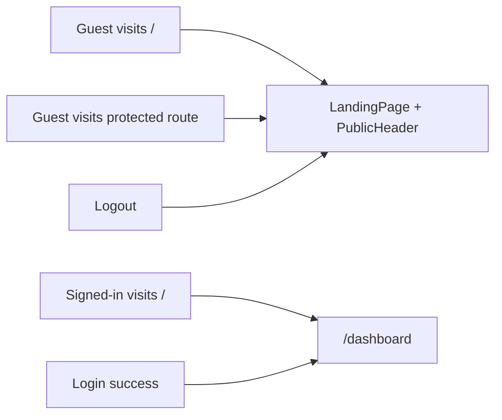

# Update: Public landing page for guests

Apply this guide to **existing apps** forked from `vibe-flight-react-template` that still send unauthenticated users straight to `/login` and use `/` as the signed-in dashboard.

**Scope:** frontend only. No API or database changes.

## What changes

| Before | After |
|--------|--------|
| `/` = protected dashboard | `/` = public marketing landing (guests only) |
| Guests hitting protected routes → `/login` | Guests → `/` |
| Login success → `/` | Login success → `/dashboard` |
| Logout → `/login` | Logout → `/` |
| Header logo / Dashboard nav → `/` | → `/dashboard` |

`/login` and `/register` stay as dedicated auth pages.



## Prerequisites

- Same layout as the template: `frontend/src/` with `App.jsx`, `ProtectedRoute`, `Header`, `AppConfigContext`, MUI v6+ (v9 in current template).
- If you customized routes, adapt the paths below consistently.

## Step 1 — Add new files

Copy these files from the latest template (or create them from the snippets below):

| File | Purpose |
|------|---------|
| `frontend/src/landing/landingContent.js` | Editable marketing copy |
| `frontend/src/components/GuestRoute.jsx` | Redirect signed-in users away from public routes |
| `frontend/src/components/PublicHeader.jsx` | Guest top bar (app name → `/`, Sign in / Sign up) |
| `frontend/src/components/PublicLayout.jsx` | Shell: `GuestRoute` + `PublicHeader` + `<Outlet />` for `/`, `/login`, `/register` |
| `frontend/src/pages/LandingPage.jsx` | Landing sections UI |

**Fastest path:** copy the files verbatim from upstream `frontend/src/...` in [vibe-flight-react-template](https://github.com/mmeany/vibe-flight-react-template) at the commit that introduced this update.

### `frontend/src/landing/landingContent.js`

```js
/** Customize marketing copy — keep LANDING_APP_NAME in sync with Header / About if you change it. */
export const LANDING_APP_NAME = 'Flight React App';

export const LANDING_HERO = {
  headline: 'Build faster with a modern full-stack template',
  subheadline:
    'PHP Flight API and React frontend with JWT auth, user settings, and Material UI. '
    + 'Replace this copy when you fork the template.',
  primaryCtaLabel: 'Sign in',
  secondaryCtaLabel: 'Create account',
};

export const LANDING_FEATURES = [
  {
    icon: 'speed',
    title: 'Fast to ship',
    description:
      'Monorepo layout, Vite dev server, and production build script. Swap this for your product’s main value proposition.',
  },
  {
    icon: 'security',
    title: 'Auth built in',
    description:
      'JWT login, optional registration, and per-user settings stored server-side. Describe your security or compliance story here.',
  },
  {
    icon: 'extension',
    title: 'Easy to extend',
    description:
      'Controller–service–repository backend and React pages you own. List integrations, modules, or workflows you plan to add.',
  },
];

export const LANDING_STEPS = [
  {
    title: 'Configure your stack',
    description: 'Set environment variables, database, and branding in this repo.',
  },
  {
    title: 'Replace placeholder content',
    description: 'Edit landing/landingContent.js and about/aboutContent.js for your product.',
  },
  {
    title: 'Ship your features',
    description: 'Add API routes and React pages behind the existing auth shell.',
  },
];

export const LANDING_CTA = {
  title: 'Ready to get started?',
  body: 'Sign in to open the dashboard, or register when public signup is enabled.',
};

export const LANDING_FOOTER =
  'Template landing page — replace sections in frontend/src/landing/landingContent.js.';
```

### `frontend/src/components/GuestRoute.jsx`

```jsx
import { Box, CircularProgress } from '@mui/material';
import { Navigate } from 'react-router-dom';
import { useAuth } from '../contexts/AuthContext';

export default function GuestRoute({ children }) {
  const { isAuthenticated, isLoading } = useAuth();

  if (isLoading) {
    return (
      <Box sx={{ display: 'flex', justifyContent: 'center', alignItems: 'center', minHeight: '100vh' }}>
        <CircularProgress />
      </Box>
    );
  }

  if (isAuthenticated) {
    return <Navigate to="/dashboard" replace />;
  }

  return children;
}
```

### `frontend/src/components/PublicHeader.jsx`

```jsx
import { AppBar, Box, Button, Toolbar, Typography, useTheme } from '@mui/material';
import { Link as RouterLink } from 'react-router-dom';
import { useAppConfig } from '../contexts/AppConfigContext';
import { LANDING_APP_NAME } from '../landing/landingContent';

export default function PublicHeader() {
  const theme = useTheme();
  const { isRegistrationEnabled, isLoading: configLoading } = useAppConfig();

  return (
    <AppBar position="sticky" color="default" elevation={0} sx={{ borderBottom: 1, borderColor: 'divider' }}>
      <Toolbar disableGutters>
        <Box
          sx={{
            maxWidth: theme.custom.maxContentWidth,
            width: '100%',
            mx: 'auto',
            px: 2,
            display: 'flex',
            alignItems: 'center',
            gap: 1,
          }}
        >
          <Typography
            variant="h6"
            component={RouterLink}
            to="/"
            sx={{ flexGrow: 1, textDecoration: 'none', color: 'text.primary', fontWeight: 600 }}
          >
            {LANDING_APP_NAME}
          </Typography>
          <Button component={RouterLink} to="/login" color="primary">
            Sign in
          </Button>
          {!configLoading && isRegistrationEnabled && (
            <Button component={RouterLink} to="/register" variant="outlined" color="primary">
              Sign up
            </Button>
          )}
        </Box>
      </Toolbar>
    </AppBar>
  );
}
```

### `frontend/src/pages/LandingPage.jsx`

Copy the full file from the template repo (`frontend/src/pages/LandingPage.jsx`). It is ~220 lines: hero, feature cards, steps, CTA band, footer. It uses MUI `Grid` with the `size={{ xs: 12, md: 4 }}` API (MUI v6+). On older MUI, replace with `item xs={12} md={4}` on `Grid` children.

---

### `frontend/src/components/PublicLayout.jsx`

```jsx
import { Box } from '@mui/material';
import { Outlet } from 'react-router-dom';
import GuestRoute from './GuestRoute';
import PublicHeader from './PublicHeader';

export default function PublicLayout() {
  return (
    <GuestRoute>
      <Box sx={{ minHeight: '100vh', display: 'flex', flexDirection: 'column' }}>
        <PublicHeader />
        <Box component="main" sx={{ flexGrow: 1 }}>
          <Outlet />
        </Box>
      </Box>
    </GuestRoute>
  );
}
```

---

## Step 2 — Update `frontend/src/App.jsx`

**Add imports:**

```jsx
import LandingPage from './pages/LandingPage';
import PublicLayout from './components/PublicLayout';
```

**Replace the public `/`, `/login`, and `/register` routes** with a nested group (login and register get the same header as the landing page; app title links home):

```jsx
<Route element={<PublicLayout />}>
  <Route index element={<LandingPage />} />
  <Route path="login" element={
    <PageContainer fullPage><LoginPage /></PageContainer>
  } />
  <Route path="register" element={
    <PageContainer fullPage><RegisterPage /></PageContainer>
  } />
</Route>
```

Do not mount `/login` or `/register` outside `PublicLayout` — guests would have no way back to `/`.

**If you already applied an older version of this guide** that only wrapped `/` in `GuestRoute` + `PublicHeader`, add `PublicLayout.jsx` and switch to the nested routes above; remove standalone `/login` and `/register` routes.

**Inside the `<Route element={<Layout />}>` block**, change the dashboard path from `/` to `/dashboard`:

```diff
- <Route path="/" element={<ProtectedRoute><DashboardPage /></ProtectedRoute>} />
+ <Route path="/dashboard" element={<ProtectedRoute><DashboardPage /></ProtectedRoute>} />
```

Leave `/settings`, `/help`, `/about`, `/admin/users` unchanged.

---

## Step 3 — Update `frontend/src/components/ProtectedRoute.jsx`

```diff
- if (!isAuthenticated) return <Navigate to="/login" replace />;
+ if (!isAuthenticated) return <Navigate to="/" replace />;
```

---

## Step 4 — Update `frontend/src/pages/LoginPage.jsx`

After successful login:

```diff
- navigate('/');
+ navigate('/dashboard');
```

---

## Step 5 — Update `frontend/src/components/Header.jsx`

1. **Logout** — send users to the landing page:

```diff
- navigate('/login');
+ navigate('/');
```

2. **Dashboard links** (drawer + avatar menu) and **app title link**:

```diff
- navigateTo('/')
+ navigateTo('/dashboard')

- to="/"
+ to="/dashboard"
```

Apply to every Dashboard `ListItemButton`, `MenuItem`, and the `Typography` `RouterLink` for the app name.

---

## Step 6 — Update help copy (optional)

In `frontend/src/help/helpTopics.js`, clarify routing if you document navigation:

- Public home: `/` (landing when signed out).
- App home after sign-in: `/dashboard`.

Example list item:

```diff
- 'Dashboard — landing page after sign-in.',
+ 'Dashboard — app home after sign-in (/dashboard).',
```

---

## Step 7 — Search your fork for other references

Grep the frontend for paths that still assume `/` is the dashboard:

```bash
cd frontend
rg "navigate\(['\`]/['\`]\)|to=['\"]/['\"]|path=['\"]/['\"]" src
```

Update any custom pages, links, or redirects you added (e.g. post-register flows can keep `/login`).

**Do not change** `PublicHeader`’s `to="/"` — that should stay on the marketing home.

---

## Customize for your product

Edit `frontend/src/landing/landingContent.js`:

- `LANDING_APP_NAME` — align with your Header / About title.
- `LANDING_HERO`, `LANDING_FEATURES`, `LANDING_STEPS`, `LANDING_CTA`, `LANDING_FOOTER` — your product messaging.

Feature `icon` keys: `speed`, `security`, `extension` (mapped in `LandingPage.jsx`; add keys there if you add icons).

---

## Verify

1. Signed out: `/` shows landing + public header (not the authenticated header).
2. Signed out: `/login` and `/register` show the same public header; app title returns to `/`.
3. Signed out: `/settings` redirects to `/` (not `/login`).
4. Landing **Sign in** → `/login`; login → `/dashboard` with full header.
5. Signed in: `/`, `/login`, and `/register` redirect to `/dashboard`.
6. Logout → `/` landing.
7. With registration disabled in API config: Sign up hidden on landing and public header; `/register` still works if opened directly.

```bash
cd frontend && npm run build && npm test
```

---

## Optional follow-ups

- Centralize `APP_DISPLAY_NAME` shared by Header, About, and `landingContent.js`.
- Add a `/` → `/dashboard` redirect route only if you need bookmark compatibility for old dashboard URLs (not required by the template).
